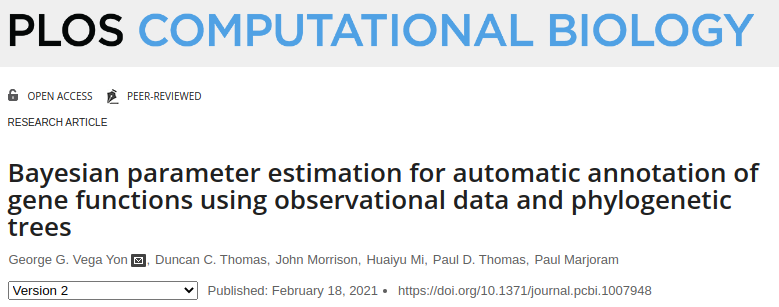
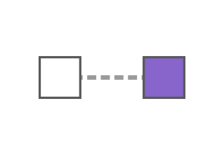
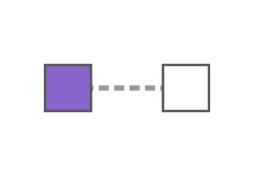
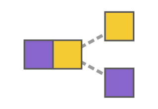
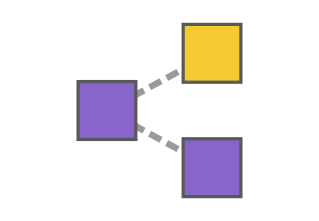
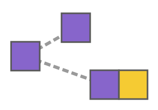
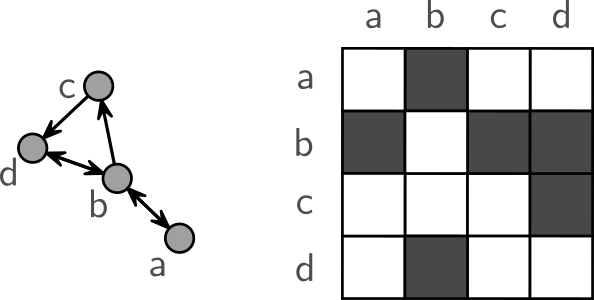
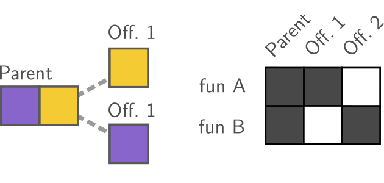
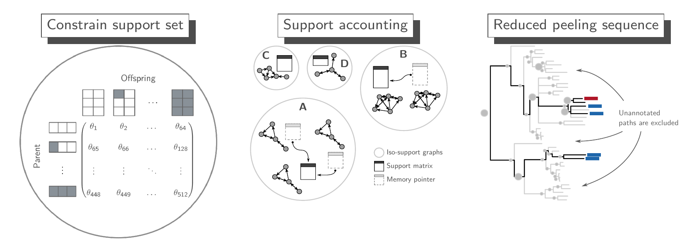

Collaborators: Paul Thomas, Paul Marjoram, Huaiyu Mi, Christopher
Williams (USC), Alun Thomas (UofU)

Table of Contents You can download the slides from
<https://ggv.cl/image2023>

# Preliminaries

Table of Contents

\<123123\>

### Gene Function

Encode the synthesis of genetic products that ultimately are related to
a particular aspect of life, for example

|                                                                                    |                                                                                |                                                                                     |
|:-----------------------------------------------------------------------------------|:-------------------------------------------------------------------------------|:------------------------------------------------------------------------------------|
| **Molecular function**                                                             | **Cellular component**                                                         | **Biological process**                                                              |
| [Active transport GO:0005215](http://amigo.geneontology.org/amigo/term/GO:0005215) | [Mitochondria GO:0004016](http://amigo.geneontology.org/amigo/term/GO:0004016) | [Heart contraction GO:0060047](http://amigo.geneontology.org/amigo/term/GO:0060047) |
|                   |                             |                                     |

Gene Function: the Gene Ontology Project

<figure>

</figure>

- The GO project has $\sim$ 43,000 validated terms, $\sim$ 7.4M
  annotations on $\sim$ 5,200 species.

- About $\sim$ 700,000 annotations are on human genes.

- Only half of the human gene annotations are based on experimental
  evidence.

- About $\sim$ 173,000 publications have used the GO.

**source**: Statistics from
<http://pantherdb.org/panther/summaryStats.jsp> and
<http://geneontology.org/stats.html>

Predicting Gene Function: State-of-the-art

Sequences, phylogenomics, and ML.

- **BLAST**: Prediction by sequence homology ($\sim$ 105,000 citations).

- **SIFTER**: An evolutionary model of gene function/loss using
  phylogenetics.

- **aphylo** (by yours truly): Another phylo-based method. Leverages
  negative annotations and pooled trees.

- **Phylo-PFP**: A BLAST-based adding phylogenetic based distances.

- **DeepGOPlus**: One of the top-performing models in the literature,
  uses a 2D convolutional neural network on gene sequences.

- **GOLabeler**: Top performing tool according to the *Critical
  Assessment of Function Annotation* \[CAFA\] challenge, is an ensemble
  of various simple ML methods, including K-means and logistic
  regression.

- **DeepFRI**: Uses Graph Convolutional Neural Networks (GCNs) to
  predict function based on protein structure and genetic sequence.

This talk has been submitted as an R01 to the National Human Genome
Research Institute \[NHGRI\]

<figure>
<embed src="fig/whole-game.pdf" />
<figcaption>Building a Novel Prediction Framework Leveraging Biological
Insights to Boost Machine Learning Algorithms for Annotating Gene
Function</figcaption>
</figure>

# Evolution of Gene Function

Table of Contents

Our progress so far

 Is the human gene
**XYZ** involved in process **ABC**, <u>given what we know about that
for other *related* species</u>?
<embed src="aphylo-data-probability.pdf" />

Evolution of Gene function (of one function)

Built a big model (lots of trees and annotations) called aphylo:

- Only two sources of data: Phylogenetic tree
  (<a href="pantherdb.org" class="uri">pantherdb.org</a>) and functional
  annotations
  (<a href="geneontology.org" class="uri">geneontology.org</a>).

- Leverage negative annotation of GO terms (NOT).

- Use Felsenstein’s tree pruning algorithm to compute tree likelihood.

- Fit pooled models featuring thousands of annotations in hundreds of
  trees (with split-second prediction capability).

<embed src="example-trees-good1-parts-1b.pdf" />

Evolution of Gene function (multiple functions) Tapping into Evol.
Theory  

- A fundamental part of Fun. Evol. is Duplication Events.

- Furthermore, knowing what happened to gene A (*e.g.*,
  neofunctionalization) is highly informative to learn about the
  functional state of B.

- One way to model this is using a Markov Transition Model (as in
  SIFTER).

<figure id="fig:duplication">
<embed src="fig/Evolution_fate_duplicate_genes_-_vector.pdf" />
<figcaption>A key part of molecular innovation, gene duplication
provides an opportunity for new functions to emerge (<a
href="https://en.wikipedia.org/wiki/File:Evolution_fate_duplicate_genes_-_vector.svg">wikimedia</a>)</figcaption>
</figure>

Evolution of Gene function (multiple functions) (cont.)

If we wanted to build a model with 3 functions, we would need to
estimate...  

  
  
parameters

m.14\<m.25m.46 Rep. & Description & Definition  
 & Gain of function &
$(1 - x_p)\sum_{n:n\in Off}x_n$  
 & Loss of function &
$x_p\sum_{n:n\in Off}(1 - x_n)$  
 & Subfunctionalization &
$x_p^kx_p^j\sum_{n\neq m}x_n^k(1-x_n^j)(1-x_m^k)x_m^j$  
 & Neofunctionalization &
$x_p^k(1 - x_p^j)\sum_{n\neq m}x_n^k(1-x_n^j)(1-x_m^k)x_m^j$  
 & Longest branch gains &
$(1-x_p^k){\boldsymbol{1}\left( x_m^k : m=\text{argmax}_n\text{blength}_n \right)}$  

<embed src="fig/Evolution_fate_duplicate_genes_-_vector.pdf" />

GEESE: **GE**ne functional **E**volution using **S**ufici**E**ncy

I implemented what I just described in a C++ library with a companion R
package called geese. The question is: How much do we earn by using
these motifs?  

- Using 37 phylogenetic trees featuring 401 go annotations.

- **aphylo**: Fitted a *simple gain/loss* of function model.

- **GEESE**: Fitted an evolutionary model controlling for *functional
  preservation* (i.e., like neofun or subfun.)

- Fitted both of them using MCMC.

- Used LOO cross-validation to compute aggregated AUCs and MAE.

GEESE for predicting gene function (cont.)

How much can we gain from a joint dist. model?

<figure id="fig:auc-geese-vs-aphylo">

<embed src="fig/mcmc-analysis-unif-prior-curated-auc-and-mae.pdf" />

</figure>

Just controlling for preservation (having only one duplicate changing)
significantly improves our predictions.

# Mechanistic Machine Learning

Table of Contents

Mechanistic Machine Learning: State-of-the-art

- After all the data pouring, attention to causal inference and
  mechanistic models is coming back

- Applications in Physics, Chemistry, Biomedical Imaging, and Biology
  show the benefits of combining the two approaches.

  

- Inference-driven (causality).

- Great for small datasets.

- Knowledge beyond the observed data.

  

- Data-driven (prediction).

- Lots of points to “learn.”

- Great for big data.

Important: Mechanistic Machine Learning **is
not** domain-knowledge aided feature engineering. You need a whole other
model to complement the ML algorithm.

Three strategies

- **ML Correction**: Use machine learning to learn the errors of a
  mechanistic model.

- **Mechanistic Feature**: Add mechanistic predictions as a feature of a
  machine learning model.

- **Mechanistic Penalty**: Add constraints to the ML algorithm based on
  a mechanistic model.

<figure>

<figcaption>“A van Gogh-style painting of an android holding a large
biology book in one hand and a computer in another, examining an
evolutionary tree that, instead of leaves, have genes.”–DALL-E’s
interpretation of my description <a
href="#https://labs.openai.com/s/s0GoDQ64OMRfMr1y6uRXtmo9">(link)</a></figcaption>
</figure>

Three strategies

#### a. ML Correction

1.  Fit the mechanistic model using GEESE

2.  Generate the mechanistic-based predictions,
    $\hat \mathbf{y}{}{}^{GEESE}$,

3.  fit an ML model $f(X{}, \Omega)$ to predict
    $\varepsilon \equiv (\mathbf{y}{}- \hat \mathbf{y}{}{}^{GEESE})$,

4.  generate the predictions of $\hat\varepsilon$, and

5.  Compute the Mechanistic-ML predictions as
    $\hat \mathbf{y}{}{}^{MML1} \equiv \hat \mathbf{y}{}{}^{GEESE} + \hat\varepsilon$

<embed src="fig/mech-ml-model-a.pdf" />

Three strategies

#### b. Mechanistic Feature

1.  Fit the mechanistic model using GEESE,

2.  generate the mechanistic-based predictions,
    $\hat \mathbf{y}{}{}^{GEESE}$,

3.  fit an ML model that uses the mechanistic predictions as features,
    $f(X{}, \Omega, \hat \mathbf{y}{}{}^{GEESE})$, and

4.  Compute the Mechanistic-ML predictions as
    $\hat \mathbf{y}{}{}^{MML2} \equiv f(X{}, \Omega, \hat \mathbf{y}{}{}^{GEESE})$

<embed src="fig/mech-ml-model-b.pdf" />

Three strategies

#### c. Mechanistic Penalty

1.  Fit the mechanistic model using GEESE and store the parameter
    estimates $\hat\theta$,

2.  minimize the following loss function:
    $$L(y_{,}^{obs} X{}, \Omega) - \mathcal{L}\left(f(y_{,}^{obs} X{}, \Omega)\right)_{GEESE},$$
    where $\mathcal{L}\left(\cdot\right)$ is the likelihood function
    under GEESE.

<embed src="fig/mech-ml-model-c.pdf" />

# Proof of Concept

Table of Contents

Beyond GO and Trees... Bgee

The  project “is a
**database** for retrieval and **comparison of gene expression**
patterns **across multiple animal species**. It provides an intuitive
answer to the question ‘where is a gene expressed?’\[.\]” –

- Raw expression annotations.

- Standardized expression scores (so can compare across
  species/tissues).

- And also yes/no expression annotations based on the standardized
  scores.

Divergence across species in gene expression levels has been linked to
evolutionary events, *i.e.*, expression levels clustered phylogenies.  

What went into the blender

Mechanistic ML

We are comparing three models:

Mechanistic ML (prelim res.)

<figure id="fig:auc-geese-plus-bgee">

<embed src="fig/logit-aucs-ols-geese.pdf" /> 

</figure>

Both AUC and MAE were computed only using predictions for which we knew
the true value.

Discussion

Thank you!

References

### Phylogenetics Modeling Strategies

<figure>
<embed src="phylo-model-overview-legend.pdf" />
</figure>

Evolution of Gene function (multiple functions)

If we wanted to build a model with 3 functions, we would need to
estimate...  

  

### Exponential Random Graph Models (ERGMs)

  

- Not about individual ties.

- Statistical inference on *motifs* (triangles, dyads, homophily, etc.)

- Literature about ERGMs is vast, a.k.a. a low-hanging fruit.

### Exponential Random Graph Models (ERGMs)

  

  

Social Networks are usually represented as **adjacency matrices**, and
so can evolutionary events!

### Tree likelihoods: Felsenstein’s Pruning algorithm

Some computational features of **barry**

<figure id="fig:barry">

 

</figure>

